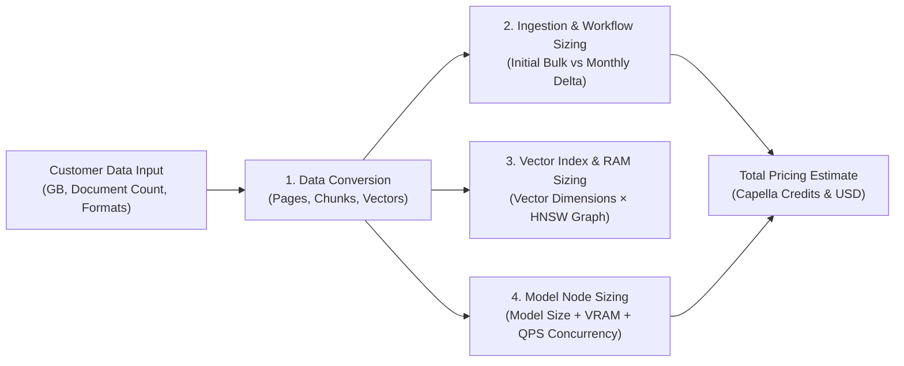
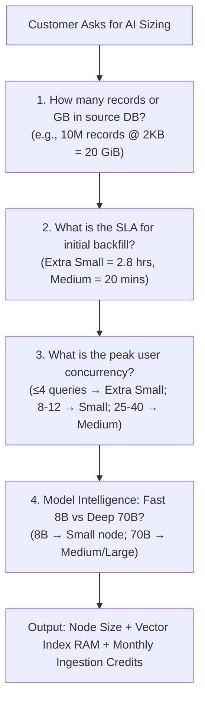
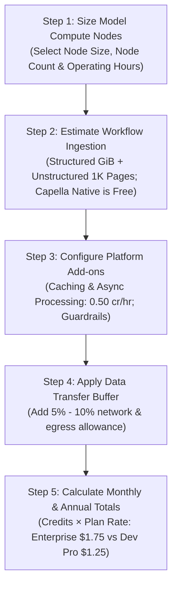

# Couchbase Capella AI Data Plane — Sizing & Pricing Workflow Guide

This guide provides the complete blueprint for **sizing customer workloads from raw data** and translating those requirements into the official **Capella AI Data Plane AWS Credits & List Prices** (AWS us-east-1).

---

## 0. Sizing Methodology: From Customer Data to Sizing Recommendation

When working with a customer, they typically know their raw data volume (e.g. *"We have 500 GB of PDFs and 200 GB of database tables"*). Follow this 4-pillar discovery framework to determine their exact compute node and workflow sizing:

---### Pillar 1: Ingestion & Data Conversion (Couchbase / Ingested JSON & Documents)

Customers frequently vectorize **millions of records from Couchbase or external databases** serialized into JSON, alongside unstructured documents.

| Ingestion Source | Record / File Size | Units per 1 GiB | Chunks & Vectors per Unit | Workflow Ingestion Rate |
|---|---|---|---|---|
| **Small Ingested Records (JSON)** (e.g. Transactions, Audit logs) | **1 KB** / doc | **~1,048,576 records / GiB** | 1 vector per record (128–256 tokens) | **0.05 credits / GiB** ($0.09 / GiB) |
| **Standard Ingested Records (JSON)** (e.g. Customer 360, Profiles) | **2 KB** / doc | **~524,288 records / GiB** | 1 vector per record (256–512 tokens) | **0.05 credits / GiB** ($0.09 / GiB) |
| **Large Ingested Documents (JSON)** (e.g. Case files, Product catalogs)| **5 KB** / doc | **~209,715 records / GiB** | 1–2 vectors per record (512–1024 tokens)| **0.05 credits / GiB** ($0.09 / GiB) |
| **Native Capella Data** (Stored in Couchbase buckets) | Any JSON size | Unlimited | 1 vector per record / chunk | **100% FREE (0.00 credits)** |
| **PDF Documents / Reports** | ~75 KB / page | ~12,500 pages / GiB | ~1.2 vectors per page (512-token chunks) | **15.625 credits / 1K pages** ($27.34 / 1K pgs) |
| **Scanned OCR / Image Docs** | ~300 KB / page | ~3,000 pages / GiB | ~1 vector per page | **15.625 credits / 1K pages** ($27.34 / 1K pgs) |

---

### Pillar 2: Hardware Throughput Benchmarks (Embedding & Generation)

Compute sizing is dictated by two independent hardware bottlenecks: **Embedding Ingestion Throughput (Docs/sec)** and **Generative Inference Concurrency (Tokens/sec)**.

#### A. Embedding Throughput Benchmark (for 2 KB JSON Docs / 512-token chunks)
*How fast each node size can vectorize historical database dumps and incoming real-time change streams (CDC):*

| Model Node Size | vCPU | GPU VRAM | Embedding Model Class | Embedding Throughput (2 KB Docs/sec) | Hourly Processing Capacity | Time to Embed 10 Million 2 KB Records |
|---|---|---|---|---|---|---|
| **Extra Small** | 4 | 24 GB | MiniLM, BAAI-bge-base (384/768-dim) | **~1,000 docs/sec** | **3.6 Million docs/hr** | **2.78 hours** |
| **Small** | 4 | 48 GB | BAAI-bge-large, E5-v2 (1024/1536-dim) | **~2,200 docs/sec** | **7.9 Million docs/hr** | **1.26 hours** |
| **Medium** | 48 | 192 GB | Multi-GPU batch embedding cluster | **~8,500 docs/sec** | **30.6 Million docs/hr** | **19.6 minutes** |
| **Large** | 96 | 687 GB | High-throughput enterprise pipeline | **~22,000 docs/sec** | **79.2 Million docs/hr** | **7.5 minutes** |
| **Extra Large** | 192 | 687 GB | Massive parallel CDC streaming | **~45,000 docs/sec** | **162.0 Million docs/hr** | **3.7 minutes** |

---

#### B. Generative LLM Throughput, Latency & Concurrency Benchmark
*Governed by GPU memory bandwidth and KV cache memory. An average paragraph answer is **~250 output tokens**:*

| Model Node Size | vCPU / GPU | LLM Model Target | Total Generative Token Pool | Latency for 250-token Answer | Max Concurrent Active Streams (Zero Queuing) |
|---|---|---|---|---|---|
| **Extra Small** | 4 / 24 GB | 3B LLM or 7B 4-bit Quantized | **~100 tokens/sec** | **~2.5 seconds** | **3 – 4 concurrent queries** |
| **Small** | 4 / 48 GB | 8B FP16 (Llama 3 8B, Mistral 7B) | **~300 tokens/sec** | **~1.0 – 1.2 seconds** | **8 – 12 concurrent queries** |
| **Medium** | 48 / 192 GB | 70B AWQ Quantized (or 4x 8B replicas) | **~1,000 tokens/sec** | **~1.5 – 1.8 seconds** | **25 – 40 concurrent queries** |
| **Large** | 96 / 687 GB | 70B Full Precision (FP16/BF16) | **~2,500 tokens/sec** | **~1.0 – 1.2 seconds** | **60 – 100 concurrent queries** |
| **Extra Large** | 192 / 687 GB | Multi-model Enterprise Cluster | **~5,000+ tokens/sec** | **< 1.0 second** | **150+ concurrent queries** |

---

### Pillar 3: Sizing Ingestion, Bulk Backfills & Real-Time CDC in Capella

When sizing an ingestion workload or database migration into Capella AI:

#### Step-by-Step Sizing Equation:
1. **Initial Table Ingestion Fee (Workflow Credits)**:
   $$\text{Table GiB} = \frac{\text{Total Records} \times \text{Average Doc Size (KB)}}{1,048,576 \text{ KB/GiB}}$$
   $$\text{Ingestion Credits} = \text{Table GiB} \times 0.05 \text{ credits/GiB} \quad (\text{Free if stored directly in Capella})$$
2. **Initial Embedding Time**:
   $$\text{Embedding Time (Hours)} = \frac{\text{Total Records}}{\text{Node Docs/Sec} \times 3,600}$$
3. **Couchbase Vector Index RAM (Search Service)**:
   $$\text{Vector Index RAM (GB)} = \frac{\text{Total Records} \times \text{Dimensions} \times 4 \times 1.35}{1024^3}$$
   *(10 million 1536-dim vectors $\approx \mathbf{77.2 \text{ GB RAM}}$).*
4. **Real-time Change Data Capture (CDC) Delta**:
   - If customer writes $100\text{ updates/second}$:
   - Real-time embedding load: $100\text{ docs/sec}$ (well within Extra Small's $1,000\text{ docs/sec}$ capacity, leaving $90\%$ of node capacity idle for ad-hoc batching).

---

### Pillar 4: Customer Discovery Flowchart

---

## I. Official Rate Matrix (AWS us-east-1)

### 1. Model Compute Nodes (Hosting & Inference)
*Model sizes are provisioned per node with dedicated GPU memory and vCPU.*

| Model Node Size | vCPU / Node | GB GPU / Node | Capella Credits / hr | Enterprise $/hr | Dev Pro $/hr | Primary Target Workloads |
|---|---|---|---|---|---|---|
| **Extra Small** | 4 | 24 GB | **3.06** | **$5.36** | N/A | Lightweight embeddings, text classification, <3B models |
| **Small** | 4 | 48 GB | **4.75** | **$8.31** | N/A | High-dim embeddings, 7B/8B quantized LLMs (Llama 3 8B, Mistral 7B) |
| **Medium** | 48 | 192 GB | **20.96** | **$36.68** | N/A | Multi-GPU inference, high concurrency, 70B quantized LLMs |
| **Large** | 96 | 687 GB | **45.68** | **$79.94** | N/A | 70B full precision LLMs, complex vision & multi-modal AI |
| **Extra Large** | 192 | 687 GB | **84.31** | **$147.54** | N/A | Massive throughput enterprise AI clusters & parallel queues |

> **Credit Conversion**: Enterprise List Price is calculated at **$1.75 per Capella Credit** ($5.36 / 3.06 ≈ $1.75).

---

### 2. Data Processing Services (Workflows & Ingestion)
*Data transformation, chunking, and ingestion pipeline charges.*

| Ingestion Source & Type | Unit of Measure | Format | Capella Credits | Dev Pro $ | Enterprise $ | Notes |
|---|---|---|---|---|---|---|
| **Data from Capella** | N/A | JSON | **FREE (0.00)** | Free | Free | Native zero-cost ingestion from Couchbase Capella clusters |
| **Structured Data (External)** | GiB | JSON | **0.05** / GiB | $0.06 / GiB | **$0.09** / GiB | Tabular / relational dumps, external JSON APIs |
| **Unstructured Data (External)** | 1,000 Pages | PDF / Docs / Other | **15.625** / 1K Pgs | $19.53 / 1K Pgs | **$27.34** / 1K Pgs | Document OCR, PDF parsing, text extraction |

---

### 3. Add-on Features & Ancillary Fees

1. **Caching & Asynchronous Processing**:
   - **Rate**: **0.50 Capella Credits / hr** per tenant per region ($0.875/hr Enterprise list).
   - **Monthly flat fee (730 hrs)**: **365 Credits** = **$638.75 / month**.
   - *Benefits*: Drastically improves latency for repeated prompts and handles asynchronous batch inference queues.
2. **Premium Security Features (Guardrails & Jailbreak Detection)**:
   - Increases the Credits/hr consumption rate per model node to inspect input prompts and LLM output streams.
3. **Data Transfer Allowance**:
   - For most workloads, inter-AZ and egress transfer fees will be **< 10%** of total bill (recommended sizing buffer: **5% to 7.5%**).

---

## II. The 5-Step Pricing Workflow

---

### Step 1: Size Model Compute Nodes
Determine the number of nodes, GPU capacity, and monthly operating hours:

$$\text{Compute Credits}_{\text{monthly}} = \sum \left( \text{Rate}_{\text{credits/hr}} \times \text{Nodes} \times \text{Hours}_{\text{month}} \right)$$

*For a standard 24/7 production month, use **730 hours**.*

---

### Step 2: Estimate Data Processing Volumes
Calculate data ingestion charges:

$$\text{Ingestion Credits}_{\text{monthly}} = (\text{Structured GiB} \times 0.05) + \left(\frac{\text{Unstructured Pages}}{1000} \times 15.625\right)$$

*(Capella-to-Capella ingestion is $0.00).*

---

### Step 3: Add Platform Services (Caching & Async)
If caching or asynchronous queueing is enabled:

$$\text{Caching Credits}_{\text{monthly}} = 0.50 \times 730 \times \text{Regions} = 365.00 \text{ Credits/region}$$

---

### Step 4: Apply Network & Transfer Buffer
Add an estimated transfer buffer (default: $7.5\%$):

$$\text{Subtotal Credits} = \text{Compute Credits} + \text{Ingestion Credits} + \text{Caching Credits}$$

$$\text{Data Transfer Credits} = \text{Subtotal Credits} \times 0.075$$

---

### Step 5: Calculate Total Credits and USD Billing

$$\text{Total Monthly Credits} = \text{Subtotal Credits} + \text{Data Transfer Credits}$$

$$\text{Total Monthly USD (Enterprise)} = \text{Total Monthly Credits} \times \$1.75$$

$$\text{Annualized Run-Rate} = \text{Total Monthly USD} \times 12$$

---

## III. Worked Scenario Example: Compliance RAG Pipeline

### Scenario Architecture:
- **Use Case**: Financial Compliance & Investigation Assistant (e.g. Western Union)
- **Model Compute**:
  - 1x **Medium** Node (48 vCPU, 192 GB GPU) for 70B Quantized LLM reasoning @ 20.96 cr/hr
  - 2x **Small** Nodes (4 vCPU, 48 GB GPU) for vector embeddings & re-ranking @ 4.75 cr/hr
- **Data Processing (Monthly)**:
  - 500 GiB external structured transaction metadata
  - 100,000 pages of external regulatory and sanction PDF filings (100 in 1K units)
  - Capella Native JSON data (Free)
- **Add-ons**:
  - Caching & Async Processing enabled (1 region)
  - 7.5% Data Transfer buffer

### Calculations:

| Line Item | Formula / Quantities | Monthly Credits | Monthly Enterprise USD |
|---|---|---|---|
| **Medium Compute** | 1 node × 730 hrs × 20.96 cr/hr | 15,300.80 cr | $26,776.40 |
| **Small Compute** | 2 nodes × 730 hrs × 4.75 cr/hr | 6,935.00 cr | $12,132.60 |
| **Structured Ingestion** | 500 GiB × 0.05 cr/GiB | 25.00 cr | $45.00 |
| **Unstructured Ingestion** | 100 (1K Pages) × 15.625 cr | 1,562.50 cr | $2,734.00 |
| **Caching & Async** | 730 hrs × 0.50 cr/hr | 365.00 cr | $638.75 |
| **Subtotal** | | **24,188.30 cr** | **$42,326.75** |
| **Data Transfer Buffer (7.5%)** | 24,188.30 cr × 7.5% | 1,814.12 cr | $3,174.51 |
| **GRAND TOTAL (Monthly)** | | **26,002.42 cr** | **$45,501.26 / mo** |
| **GRAND TOTAL (Annual)** | × 12 months | **312,029.07 cr** | **$546,015.07 / yr** |

---

## IV. Included Tools & Artifacts

1. **Interactive Web Calculator**: Open [`pricing_calculator.html`](file:///Users/austin.gonyou/Documents/WestenUnion/pricing_calculator.html) in your browser to adjust sliders, view live charts, and export PDF/JSON quotes.
2. **Python Pricing Engine CLI**: Run `python3 pricing_calculator.py --help` or `python3 pricing_calculator.py --preset compliance-rag` for automated sizing.
